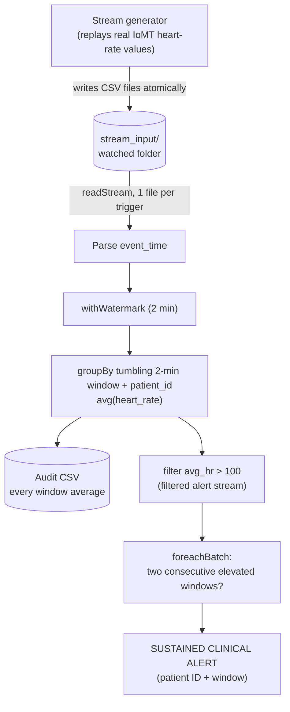

# Real-Time ICU Heart-Rate Monitor (Spark Structured Streaming)

Scenario B — Hospital Patient Monitoring. A Spark Structured Streaming pipeline
that detects **sustained** elevated heart rates across ICU patient streams using
**tumbling 2-minute windows**, and raises a clinical alert when a patient's
average heart rate exceeds 100 bpm in **two consecutive windows**.

Course: ENGR 5785G — Real-time Data Analytics for IoT.

## Architecture

## What it does

- Reads a simulated live stream from a watched directory (`readStream`).
- Computes average heart rate per patient per tumbling 2-minute window, with a
  watermark to bound state (`withWatermark`).
- Writes an audit trail of every window average to CSV.
- Emits a filtered alert stream for windows above 100 bpm, and escalates to a
  **SUSTAINED CLINICAL ALERT** when a patient is elevated in two consecutive
  windows.

## Project layout

    src/stream_generator.py   replays the dataset into the watched folder
    src/icu_monitor.py        the Spark Structured Streaming job
    data/iomt_sample.csv      heart-rate sample (IoMT dataset, Kaggle)
    output/window_averages/   audit CSV of every window average (generated)
    docs/writeup.md           window-choice and state explanation
    docs/alert_screenshot.png alert firing in the Spark console

## Requirements

- Python 3.10+ and Java 17 (or 21)
- PySpark 4.1.x (see `requirements.txt`)

## Setup

    python3 -m venv venv
    source venv/bin/activate
    pip install -r requirements.txt

## How to run

Open two terminals, both with the virtual environment active.

Terminal 1 — start the monitor (it watches the input folder and waits):

    source venv/bin/activate
    rm -f stream_input/*.csv
    python src/icu_monitor.py

Wait until it prints `ICU monitor running. Waiting for windows to close...`.

Terminal 2 — start the stream generator:

    source venv/bin/activate
    python src/stream_generator.py

Within about a minute, Terminal 1 prints the elevated windows and the
`*** SUSTAINED CLINICAL ALERT ***` lines for the at-risk patients.

## Outputs

- **Console**: elevated windows and the sustained clinical alerts.
- **`output/window_averages/*.csv`**: a full audit trail of every patient's
  average heart rate in every window (not just the alarms).

## Dataset

IoMT health-monitoring dataset (Kaggle). The generator auto-detects the
heart-rate column, and falls back to realistic synthetic values if the CSV is
absent, so the pipeline always runs.
